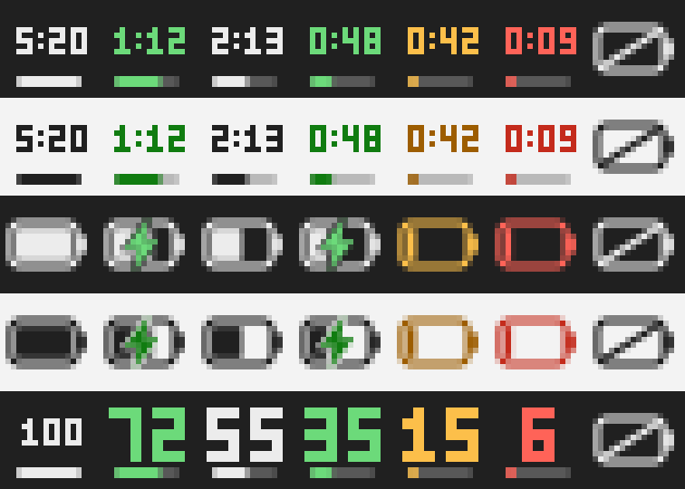

# Batéria

Ikona v oznamovacej oblasti Windowsu (vpravo dole pri hodinách), ktorá
priamo v paneli ukazuje **čas do plného nabitia** a **čas do vybitia** –
teda `2:13` namiesto `55 %`. To, čo Windows sám nepovie.



*Hore: režim „batéria“ na tmavom a svetlom paneli. Dole: režim „percentá“.*

## Čo to robí

**Bublina pri ikone** (stačí nabehnúť myšou):

```
73 % – nabíja sa
Do plného nabitia: 1 h 12 min
Nabíjanie: 24,5 W
```

Na batérii sa namiesto toho ukáže `Do vybitia: 2 h 40 min`.

**Kliknutie ľavým tlačidlom** otvorí okno s podrobnosťami: percentá, stav,
zostávajúci čas, kapacita v mWh, zdravie batérie (súčasná plná kapacita oproti
návrhovej), počet nabíjacích cyklov, napätie a zdroj odhadu. Keď je počítač
v sieti, pribudne riadok **Výdrž po odpojení** – odhad podľa toho, ako rýchlo
sa batéria vybíjala naposledy.

**Kliknutie pravým tlačidlom** otvorí ponuku: prepnutie vzhľadu ikony,
spúšťanie s Windowsom a ukončenie.

### Text priamo v paneli úloh

Okrem ikony vypisuje aplikácia zostávajúci čas aj ako **text priamo v paneli
úloh** (`2 h 13 min`), aby bol čitateľný na prvý pohľad. Kreslí ho samostatný
program `bateria-panel.exe`, ktorý je zabalený v hlavnom programe a pri prvom
spustení sa rozbalí vedľa nastavení.

Jeho okno je **potomkom okna panela úloh** (`Shell_TrayWnd`), nie voľne
plávajúcim oknom navrchu: Windows ho oreže na plochu panela, posúva ho spolu
s ním, skryje ho, keď sa panel skryje, a zruší ho, keď panel zanikne.

* **Posunutie:** podržať `Ctrl` a potiahnuť text myšou. Poloha sa uloží
  a drží sa pravého okraja panela, takže sa nehýbe, keď pribudnú ikony vľavo.
* **Bez `Ctrl`** je text pre myš priehľadný – kliknutia idú tomu, čo je pod
  ním, takže nič neprekáža.
* **Pravé tlačidlo** otvorí rovnakú ponuku ako ikona.
* Vypnúť sa dá v ponuke položkou *Text v paneli úloh*. Keď je zapnutý, ikona
  ukazuje obrys batérie, aby sa ten istý údaj nezobrazoval dvakrát.

Je to zámerne samostatný program, nie súčasť hlavnej aplikácie: okno potomka
cudzieho procesu zdieľa s panelom vstupnú frontu, takže čokoľvek pomalé v tom
vlákne by spomalilo aj panel úloh. Tento program preto nerobí nič iné, než že
kreslí text, ktorý dostane – žiadne čítanie batérie, žiadne súbory, žiadne
čakanie.

Text sa zobrazuje len na hlavnom paneli úloh; na ďalších monitoroch zatiaľ nie.

### Vzhľad ikony

Na výber sú štyri režimy (ponuka pravého tlačidla):

* **zostávajúci čas** (predvolené) – čas priamo v paneli: `2:13` sú dve
  hodiny a trinásť minút, `0:45` tri štvrte hodiny. Od desiatich hodín
  vyššie ostane len `12h`, minúty tam aj tak nikoho nezaujímajú. Kým odhad
  nie je hotový, ukáže sa percento. Pod textom je tenký prúžok nabitia,
  ktorý pri nabíjaní zozelenie, pod 20 % zožltne a pod 10 % sčervenie.
* **ako vo Windowse** – použije sa ten istý znak, akým kreslí
  ikonu batérie samotný panel úloh: `Segoe Fluent Icons` vo Windowse 11,
  `Segoe MDL2 Assets` vo Windowse 10. Znak sa vykreslí cez GDI, alfa sa
  odvodí z jasu a výsledok sa podľa skutočného obrysu umiestni na stred
  ikony. Keď písmo alebo konkrétny znak v systéme nie sú, ticho sa použije
  kreslená ikona.
* **kreslená** – vlastná ikona vykreslená znamienkovými vzdialenostnými
  funkciami. Hrany sú vyhladené, takže pekne vyzerá v 16, 20, 24 aj 32 px.
* **percentá** – číslo v paneli a pod ním tenký prúžok nabitia.

Ikona sa sama prispôsobí svetlému aj tmavému panelu úloh a mierke DPI
(na obrazovkách so 150 % sa vykreslí vo vyššom rozlíšení, nie rozmazane).
Pri nabíjaní je zelená, pri nabití pod 20 % žltá a pod 10 % červená.

## Odkiaľ sa berie čas do plného nabitia

Toto je jadro celej aplikácie. Windows cez `GetSystemPowerStatus` hlási len
čas do vybitia (`BatteryLifeTime`) – a čas do plného nabitia
(`BatteryFullLifeTime`) v praxi vracia „neznáme“. Preto aplikácia siaha
priamo na ovládač batérie:

1. **Ovládač batérie** (`IOCTL_BATTERY_QUERY_STATUS` cez `setupapi`) – dá
   okamžitý tok energie v mW aj kapacitu v mWh. Čas do plného nabitia je potom
   `(plná kapacita − aktuálna) / tok`, čas do vybitia `aktuálna / tok`.
   Okamžitá hodnota kolíše podľa zaťaženia počítača, preto sa vyhladzuje
   exponenciálnym priemerom s časovou konštantou 45 sekúnd.
2. **Vlastné meranie v čase** – keď ovládač tok nehlási (stáva sa to), použije
   sa smernica priamky preloženej meraniami za posledných 12 minút
   (metóda najmenších štvorcov).
3. **Odhad Windowsu** – posledná záchrana, funguje len pre čas do vybitia.

Ktorý zdroj sa práve použil, je vidieť v okne s podrobnosťami v riadku
*Zdroj odhadu*. Nezmyselné výsledky (kratšie než 30 sekúnd alebo dlhšie než
72 hodín) sa zahadzujú a pri zmene stavu (pripojenie nabíjačky) sa história
meraní vynuluje, aby sa nemiešali dva rôzne režimy.

Prvú minútu po spustení môže byť namiesto času napísané `Čas sa ešte počíta…`
– kým nie sú aspoň tri merania z minimálne 90 sekúnd.

## Zostavenie

Treba [Go 1.22+](https://go.dev/dl/). Žiadne ďalšie knižnice – projekt nemá
jedinú externú závislosť, takže `go build` funguje aj bez internetu.
Preložený `bateria-panel.exe` je v repozitári, takže na zostavenie netreba ani
prekladač C++; prekresliť sa dá cez `make panel` (vyžaduje MinGW).

Vo Windowse:

```powershell
powershell -ExecutionPolicy Bypass -File build.ps1
```

Alebo priamo:

```powershell
go build -trimpath -ldflags "-H=windowsgui -s -w" -o dist\bateria.exe .\cmd\bateria
```

`-H=windowsgui` je dôležité – bez neho by sa pri každom spustení otvorilo aj
čierne okno konzoly.

Na Linuxe alebo macOS sa dá `.exe` pripraviť tiež (`make build`), Go vie
prekladať pre iný systém.

## Spustenie

Stačí spustiť `bateria.exe`. Ikona sa objaví v paneli úloh – ak ju Windows
schová do prepadovej ponuky (šípka `^`), dá sa vytiahnuť potiahnutím myšou
alebo cez *Nastavenia → Prispôsobenie → Panel úloh → Ikony v rohu panela úloh*.

Aby sa aplikácia spúšťala po prihlásení, stačí v ponuke pravého tlačidla
zapnúť **Spúšťať s Windowsom** (zapíše sa hodnota do
`HKCU\Software\Microsoft\Windows\CurrentVersion\Run`).

Naraz beží len jedna inštancia; druhé spustenie sa ticho ukončí.

### Vstavaná ikona Windowsu

Systémovú ikonu batérie nahradiť ani upraviť nejde – je súčasťou Prieskumníka.
Táto aplikácia je samostatná ikona vedľa nej. Vo Windowse 10 sa tá pôvodná dá
vypnúť v *Nastavenia → Prispôsobenie → Panel úloh → Zapnutie alebo vypnutie
systémových ikon → Napájanie*. Windows 11 túto možnosť v nastaveniach nemá.

## Nastavenia

Uložené sú v `%APPDATA%\Bateria\config.json`:

```json
{
  "icon_mode": "time",
  "refresh_seconds": 2
}
```

* `icon_mode` – `time` (zostávajúci čas, predvolené), `system` (znak zo
  systémového písma), `battery` (vlastná kreslená ikona) alebo `percent`
  (číslo v paneli). Prepína sa aj v ponuke pravého tlačidla.
* `refresh_seconds` – ako často sa meria (1 až 60 sekúnd).

Pri poškodenom súbore sa použijú predvolené hodnoty; aplikácia sa kvôli
nastaveniam nikdy nezastaví.

## Keď sa ikona neobjaví

Windows 11 nové ikony v paneli **schováva pod šípku `^`** vedľa hodín.
Viditeľnosť si pamätá v registri pod
`HKCU\Control Panel\NotifyIconSettings`: každá aplikácia tam má podkľúč
s cestou k programu a hodnotou `IsPromoted` (1 = priamo v paneli).

Aplikácia si preto pri prvom spustení sama nastaví `IsPromoted` na svojom
vlastnom zázname – podkľúč vytvára Prieskumník, až keď ikonu prvýkrát uvidí,
takže sa o to pokúsi dve sekundy po štarte a v prípade potreby to ešte
párkrát zopakuje. Mení len svoj vlastný záznam a len raz: keď si ju
používateľ neskôr schová, aplikácia mu to späť neprepíše.

Najistejšie je **potiahnuť ikonu myšou** z ponuky pod šípkou priamo na panel
úloh – Windows si to zapamätá okamžite a bez odhlásenia.

Ručne sa to dá prepnúť aj v ponuke pravého tlačidla položkou
**Zobraziť ikonu vždy v paneli**, prípadne v *Nastavenia → Prispôsobenie →
Panel úloh → Iné ikony na systémovej lište*. Ak sa zmena neprejaví hneď,
pomôže odhlásenie a prihlásenie do Windowsu.

Vo Windowse 10 sa ikony ovládajú inde – *Nastavenia → Prispôsobenie → Panel
úloh → Vybrať ikony zobrazené na paneli úloh*.

Keď aplikácia beží a program sa spustí znova, opýta sa, či má bežiacu
verziu ukončiť a nahradiť novou. Ukončiť sa dá aj priamo:

```powershell
.\bateria.exe -quit
```

A keď sa nestane vôbec nič:

```powershell
.\bateria.exe -diag
```

Otvorí sa okno s tým, čo aplikácia v systéme vidí – či nájde batériu, aký
tok energie hlási ovládač, akú veľkosť má mať ikona a či je k dispozícii
systémové písmo symbolov. Keď aplikácia spadne, chybu zapíše do
`%TEMP%\bateria-chyba.txt` a ukáže ju v okne, takže nikdy nezmizne bez slova.

Ak `bateria.exe` zmizne hneď po stiahnutí, pravdepodobne ho odstránil
antivírus alebo SmartScreen – program nie je podpísaný certifikátom.

## Ako je to poskladané

```
panel/panel.cpp  program, ktorý kreslí text v paneli úloh (C++, MinGW)
cmd/bateria      spustiteľný program
cmd/icongen      vygeneruje assets/app.ico a docs/ikony.png zo zdrojáku ikony
internal/battery stav batérie + odhady časov (jadro, plne otestované)
internal/icon    kreslenie ikony (SDF, vyhladené hrany, ostré číslice),
                 mapovanie stavu na znak systémového písma a práca s maskou
internal/config  nastavenia
internal/panelbin  zabalený bateria-panel.exe + jeho rozbalenie
internal/win     tenká vrstva nad Win32 API (bez externých závislostí)
internal/winui   ikona v paneli, ponuka, okno s podrobnosťami
```

Logika odhadov, kreslenie ikony aj texty sú oddelené od Win32 kódu, takže sa
dajú testovať kdekoľvek:

```
go test ./...
```

## Známe obmedzenia

* Niektoré ovládače hlásia kapacity v bezrozmerných jednotkách namiesto mWh.
  Časy sú aj vtedy správne (jednotky sa vykrátia), ale watty a kapacita sa
  neukážu.
* Odhad **Výdrž po odpojení** sa objaví, až keď aplikácia aspoň chvíľu videla
  beh na batérii – dovtedy nemá z čoho počítať.
* Pri dvoch a viac batériách sa kapacity aj tok spočítajú dohromady; systém
  ich aj tak používa ako jeden zdroj.
